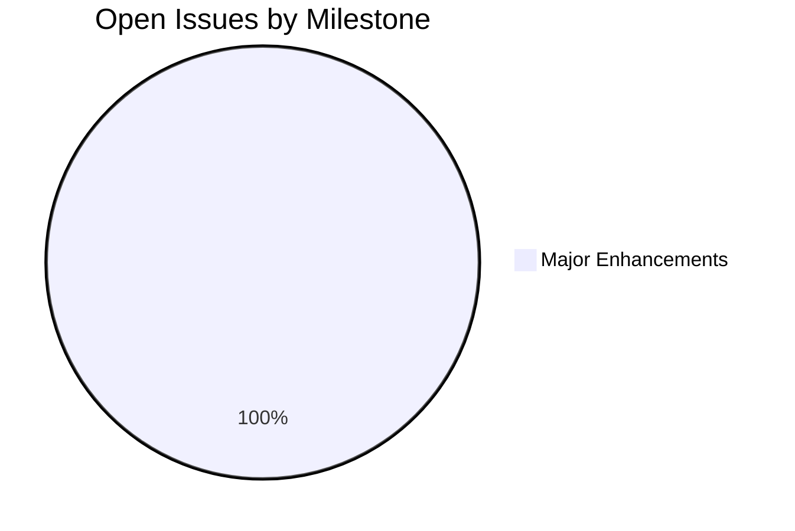
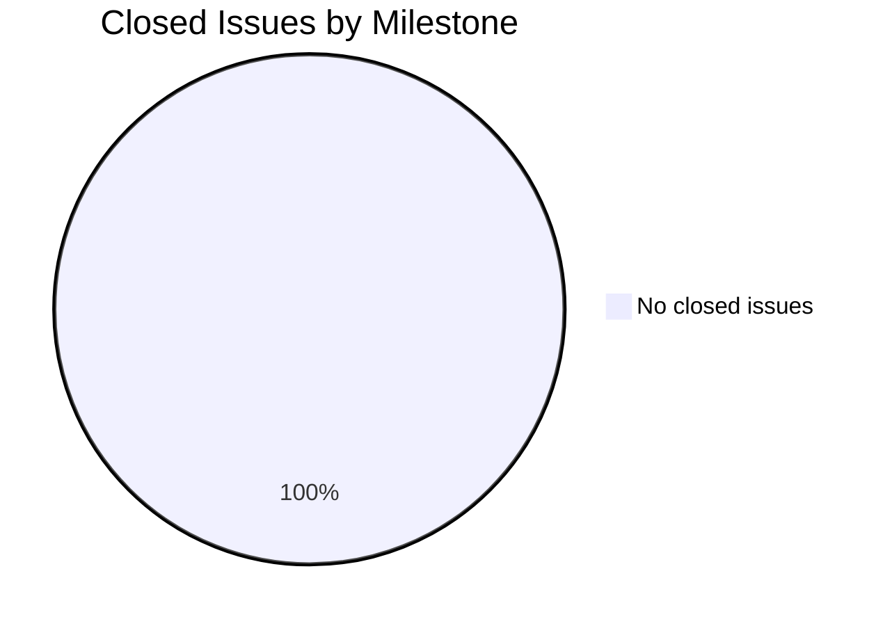
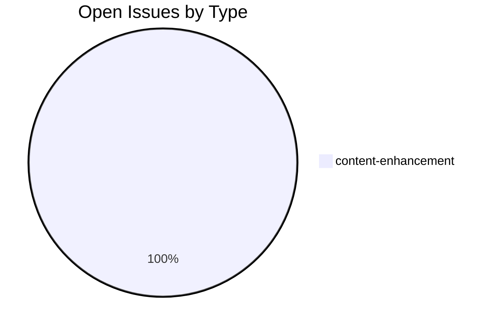
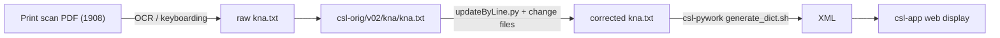

# KNA — Knauer Sanskrit-Russian Vocabulary

This repository is part of the [Cologne Digital Sanskrit Lexicons](https://www.sanskrit-lexicon.uni-koeln.de/) project. It tracks corrections and enhancements for the digitization of Friedrich Knauer's *Sanskrit-Russian Vocabulary* (1908), a 3,271-entry Sanskrit-Russian lexicon extracted from his *Учебник санскритского языка* (Sanskrit Manual). The source file lives in the `csl-orig` sibling repository; this repo holds documentation, citation metadata, and issue tracking.

## Contents

| Item | Purpose |
|---|---|
| `CLAUDE.md` | Developer documentation for Claude Code and contributors |
| `README.md` | This file — project overview |
| `CITATION.cff` | Academic citation metadata in CFF 1.2.0 format |

## Timeline

| Period | Work |
|---|---|
| 1908 | *Учебник санскритского языка* printed (Leipzig); contains the Sanskrit-Russian vocabulary |
| 2020 | KNA scan digitization initiated under Cologne project |
| Feb 2026 | GitHub repository created (`Initial commit`) |
| May 2026 | CLAUDE.md and CITATION.cff added; issue taxonomy and runbook applied |

## Projects & Milestones

| Milestone | Open | Closed |
|---|---|---|
| Dictionary to Book | 0 | 0 |
| Digitization Quality | 0 | 0 |
| Structured Data | 0 | 0 |
| Major Enhancements | 1 | 0 |

## Issue Typology

### Open Issues

| # | Title | Type | Severity | Milestone |
|---|---|---|---|---|
| [#1](https://github.com/sanskrit-lexicon/KNA/issues/1) | Knauer Sanskrit-Russian Vocabulary: Source Files | content-enhancement | medium | Major Enhancements |

### Solved Issues

No closed issues yet.

## Labels

### Type Labels (color `#0075ca`)

| Label | Description |
|---|---|
| `link-target` | Building click-throughs from `<ls>` abbreviations to scanned PDF pages |
| `link-splitting` | Splitting combined `SOURCE N,N` refs into individual per-page links |
| `markup` | Normalising XML tag content (`<ls>`, `<lex>`, `<ab>`, etc.) |
| `text-correction` | Corrections to Russian definitions or Sanskrit headwords |
| `content-enhancement` | New material, display upgrades, structural additions beyond correction |
| `encoding` | SLP1/AS/IAST transcoding, character rendering, hyphen/dash normalisation |
| `scan-quality` | Replacing blurry, skewed, or missing scan pages |
| `bug` | Broken links, XML structure errors, broken download files |
| `question` | Scholarly or editorial questions requiring research |

### Severity Labels

| Label | Color | When to use |
|---|---|---|
| `minor` | `#e4e669` | Targeted, self-contained fix |
| `medium` | `#fbca04` | Standard unit of work — one index, a batch of corrections |
| `hard` | `#d93f0b` | Large effort spanning many sources, files, or dictionaries |

## Encoding

- UTF-8 NFC throughout.
- Sanskrit text in SLP1 transliteration, wrapped in `{#…#}`.
- Display layer uses IAST (ISO 15919) and Devanagari, generated via `transcoder/`.
- Source language of definitions: Russian.
- Round-trip SLP1 ↔ IAST ↔ Devanagari is lossless for all correctly marked entries; exceptions are tracked with the `encoding` issue label.

## How it works

## Source

- **Author**: Knauer, Friedrich (Ф. И. Кнауэр)
- **Title**: *Учебник санскритского языка. Грамматика, хрестоматия, словарь* (*Sanskrit Manual — Grammar, Reader, Vocabulary*)
- **Publisher**: Leipzig: Harrassowitz
- **Year**: 1908
- **Vocabulary extent**: 95 pages, 3,271 L-entries
- **Scans**: [Google Drive PNG](https://drive.google.com/file/d/1N1tH_eOwF2Kq1zN28FKkjGctN2-TlH_t/view) · [Wikimedia PDF (1908)](https://commons.wikimedia.org/wiki/File:%D0%9A%D0%BD%D0%B0%D1%83%D1%8D%D1%80-%D0%A4.%D0%98.-%D0%A3%D1%87%D0%B5%D0%B1%D0%BD%D0%B8%D0%BA-%D1%81%D0%B0%D0%BD%D1%81%D0%BA%D1%80%D0%B8%D1%82%D1%81%D0%BA%D0%BE%D0%B3%D0%BE-%D1%8F%D0%B7%D1%8B%D0%BA%D0%B0-1908.pdf)
- **WorldCat**: [931971175](https://search.worldcat.org/title/931971175)
- **First digitisation**: Cologne Digital Sanskrit Lexicon project, 2020

## Contributors

| Login | Contributions |
|---|---|
| [@gasyoun](https://github.com/gasyoun) | 3 |
